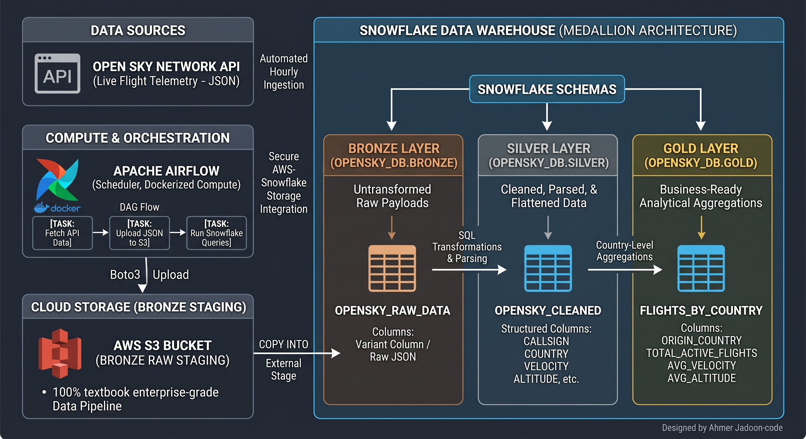

# opensky-radar-pipeline
An automated ETL pipeline fetching real-time flight data from OpenSky API, orchestrated with Apache Airflow, and transformed in Snowflake using Medallion Architecture.

# OpenSky Medallion Data Pipeline

An end-to-end automated data engineering pipeline built with **Apache Airflow**, **Amazon Web Services (AWS S3)**, and **Snowflake** utilizing the **Medallion Architecture** pattern (Bronze, Silver, Gold). This project extracts live global flight telemetry data from the OpenSky Network API, stages it in cloud object storage, and transforms it through structured data warehouse layers to deliver clean, business-ready analytics.

---

## Architecture Overview




```text
[ OpenSky API ] 
       │
       ▼ (Python / Airflow)
[ AWS S3 Bucket (Bronze Raw Storage) ]
       │
       ▼ (Snowflake External Stage & Copy Into)
[ Snowflake Bronze Layer (OPENSKY_RAW_DATA) ]
       │
       ▼ (SQL Transformations & Parsing)
[ Snowflake Silver Layer (OPENSKY_CLEANED) ]
       │
       ▼ (Aggregations & Analytics)
[ Snowflake Gold Layer (FLIGHTS_BY_COUNTRY) ]

Bronze Layer (Ingestion & Raw Staging): Airflow's PythonOperator fetches live JSON flight states from the OpenSky Network API and writes raw payloads directly to an AWS S3 bucket. A SnowflakeOperator then ingests these raw files into the Snowflake Bronze table (OPENSKY_RAW_DATA) using a secure S3 storage integration.

Silver Layer (Cleaning & Parsing): Raw JSON attributes are flattened, parsed, and cast into structured columns (such as callsigns, countries, velocities, and altitudes) within the Silver table (OPENSKY_CLEANED).

Gold Layer (Aggregations & Business Intelligence): Data is aggregated by country to compute key performance indicators, including total active flights, average aircraft velocity, and average altitude, stored in the final Gold table (FLIGHTS_BY_COUNTRY).

Tech Stack
Orchestration: Apache Airflow (running in Docker containers)

Storage: Amazon Web Services (AWS S3)

Data Warehouse: Snowflake (Bronze, Silver, Gold schemas)

Language & Scripting: Python, SQL, Boto3, Requests

Environment: Docker & Docker Compose, GitHub Codespaces

Project Structure

opensky-radar-pipeline/
│
├── dags/
│   ├── opensky_ingestion_dag.py     # Main Airflow DAG orchestrating the pipeline
│   └── sql/
│       ├── 01_setup_integrations.sql  # Snowflake database, schemas, and S3 integrations
│       ├── 02_bronze_layer.sql        # Copy command from S3 stage to Bronze raw table
│       ├── 03_silver_layer.sql        # Parsing JSON and populating Silver clean table
│       └── 04_gold_layer.sql          # Country-level aggregations for Gold analytics
│
├── config/                            # Configuration files and templates
├── logs/                              # Airflow execution logs
├── plugins/                           # Custom Airflow plugins
├── scripts/                           # Standalone utility scripts for manual testing
├── .env                               # Environment variables (Ignored in Git)
├── .gitignore                         # Git exclusion rules
├── docker-compose.yaml                # Airflow multi-container orchestration setup
├── README.md                          # Project documentation
└── requirements.txt                   # Python package dependencies

Key Features
Automated Hourly Ingestion: Fully scheduled Airflow DAG running end-to-end tasks with built-in retry logic and error handling.

Modular Task Dependencies: Structured sequence linking ingestion, raw loading, data cleaning, and final analytical aggregation (fetch_data >> bronze_layer >> silver_layer >> gold_layer).

Secure Cloud Integration: Seamless IAM role-based authentication between AWS S3 and Snowflake using secure storage integrations.

Environment Isolation: Configured inside a containerized Docker environment with custom search paths for SQL templates.

Setup & Installation

1. Clone the Repository
Bash
git clone [https://github.com/Ahmer-Jadoon/opensky-radar-pipeline.git](https://github.com/Ahmer-Jadoon/opensky-radar-pipeline.git)
cd opensky-radar-pipeline

2. Configure Environment Variables
Create a .env file in the root directory and configure your credentials:

Plaintext
AWS_ACCESS_KEY_ID=your_aws_access_key
AWS_SECRET_ACCESS_KEY=your_aws_secret_key
SNOWFLAKE_USER=your_username
SNOWFLAKE_PASSWORD=your_password
SNOWFLAKE_ACCOUNT=your_account_identifier


3. Launch Airflow via Docker Compose
Bash
docker compose up -d


4. Configure Airflow Variables
Access the Airflow UI, navigate to Admin > Variables, and add your AWS credentials:

AWS_ACCESS_KEY

AWS_SECRET_KEY

Usage & Verification
Trigger the opensky_medallion_pipeline DAG from the Airflow web UI. Once all tasks complete successfully, run the following queries in your Snowflake worksheet to verify data across layers:

SQL
-- View Raw Data (Bronze)
SELECT * FROM OPENSKY_DB.BRONZE.OPENSKY_RAW_DATA LIMIT 5;

-- View Cleaned Data (Silver)
SELECT * FROM OPENSKY_DB.SILVER.OPENSKY_CLEANED LIMIT 5;

-- View Final Analytics (Gold)
SELECT * FROM OPENSKY_DB.GOLD.FLIGHTS_BY_COUNTRY LIMIT 10;